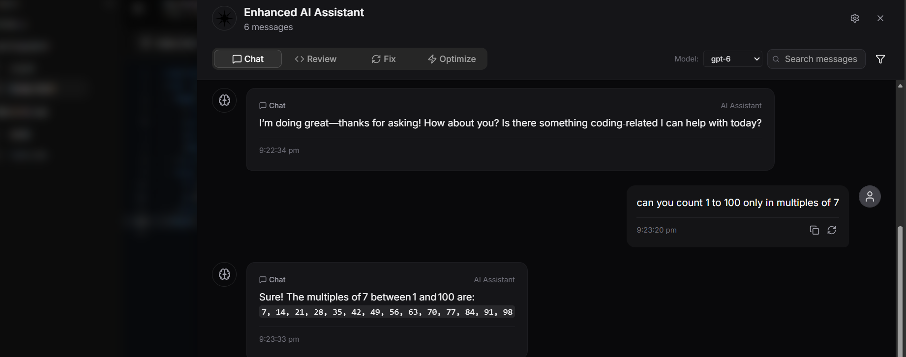
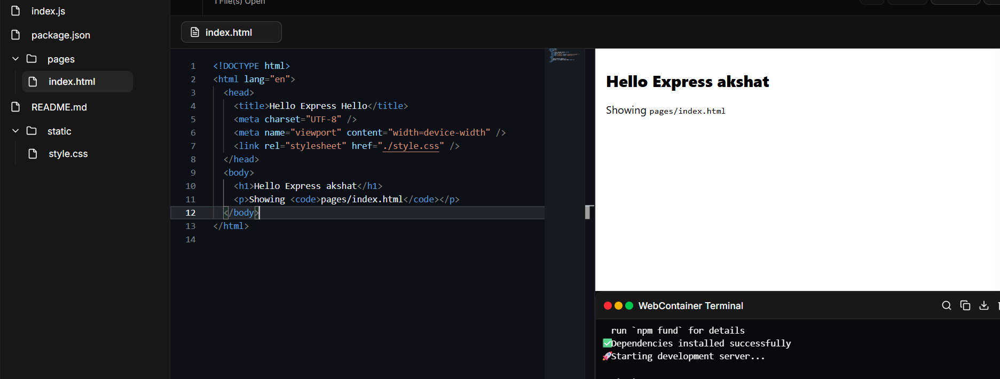
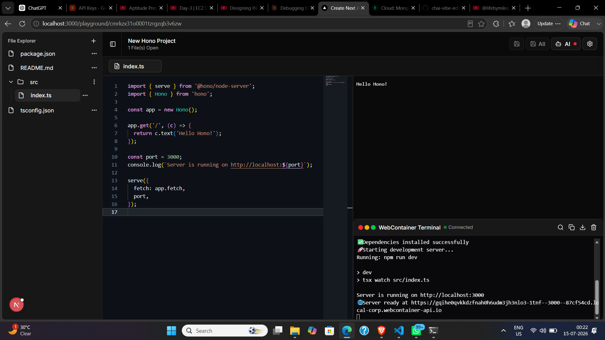

# Polar 🚀

An AI-powered browser IDE that lets users generate, edit, and run projects directly in the browser using WebContainers and AI assistance.


---

## ✨ Features

- 🤖 AI-powered code generation
- 💬 Chat-based coding assistant
- 📁 Browser file explorer
- 📝 Monaco code editor (VS Code-like experience)
- ⚡ WebContainers for running projects in the browser
- 🔄 Live preview support
- 🎨 Beautiful UI built with shadcn/ui
- 🌙 Dark mode support
- 🔐 Authentication with NextAuth
- 🗄️ Database support with Prisma
- 📦 Multiple project templates
- 💾 Save and manage projects

---

## 🖥️ Demo
## 📸 Screenshots

### 💬 Chat With AI


### 🤖 AI Suggestions


### 🖥️ Live Terminal

---

## 🛠️ Tech Stack

### Frontend
- Next.js 15
- React 19
- TypeScript
- Tailwind CSS v4
- shadcn/ui
- Radix UI
- Zustand

### Editor & Runtime
- Monaco Editor
- WebContainers API
- xterm.js

### Backend
- Next.js API Routes
- Prisma ORM
- NextAuth

### AI
- Groq API
- OpenAI Compatible Models
- Code Generation & Chat Assistance

---

## 📂 Project Structure

```bash
app/
components/
hooks/
lib/
modules/
prisma/
public/
```

---

## 🚀 Getting Started

### 1. Clone the repository

```bash
git clone https://github.com/yourusername/polar.git
cd polar
```

---

### 2. Install dependencies

```bash
npm install
```

---

### 3. Create environment variables

Create a `.env.local` file.

```env
DATABASE_URL=

AUTH_SECRET=
AUTH_GITHUB_ID=
AUTH_GITHUB_SECRET=

GROQ_API_KEY=
```

---

### 4. Setup Prisma

```bash
npx prisma generate
npx prisma migrate dev
```

---

### 5. Run the development server

```bash
npm run dev
```

Open:

```text
http://localhost:3000
```

---

## 🤖 AI Configuration

This project supports Groq-hosted models.

Example:

```ts
model: "llama-3.3-70b-versatile"
```

or

```ts
model: "openai/gpt-oss-20b"
```

---

## 📸 Screenshots

### Editor

_Add screenshot here._

### AI Assistant

_Add screenshot here._

### Live Preview

_Add screenshot here._

---

## 🔥 Key Features

### AI Code Generation
Generate complete applications from natural language prompts.

### Browser Runtime
Run Node.js applications entirely inside the browser using WebContainers.

### Live Editing
Edit files with Monaco Editor and instantly preview changes.

### Project Templates
Create Express, React, and other starter projects.

---

## 🌍 Deployment

### Vercel

```bash
npm run build
```

Add the following environment variables in Vercel:

```env
DATABASE_URL=
AUTH_SECRET=
GROQ_API_KEY=
```

Deploy:

```bash
vercel
```

---

## 📈 Future Improvements

- [ ] Collaborative editing
- [ ] Multi-file AI editing
- [ ] Git integration
- [ ] Terminal command suggestions
- [ ] Project sharing
- [ ] Deploy projects directly from the IDE
- [ ] AI debugging assistant

---

## 🤝 Contributing

Contributions, issues, and feature requests are welcome.

```bash
fork 🍴
clone 📥
create branch 🌿
commit changes ✅
open PR 🚀
```

---

## 📄 License

This project is licensed under the MIT License.

---

## 👨‍💻 Author

**Akshat**

- GitHub: https://github.com/yourusername
- LinkedIn: https://linkedin.com/in/yourprofile

---

⭐ If you like this project, consider giving it a star!